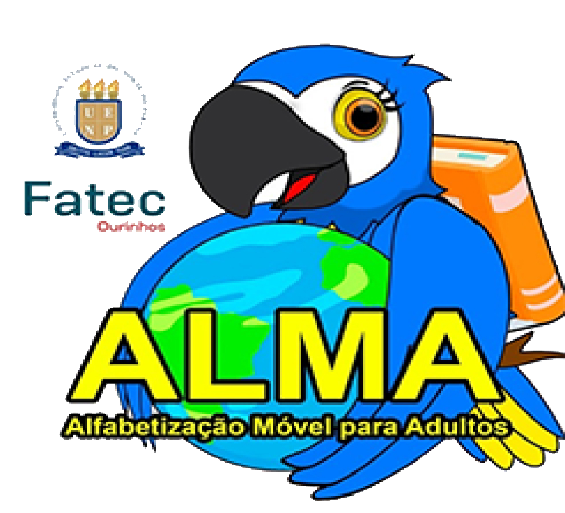

  

## ALMA - Ensino de Jovens e Adultos (EJA)
Este projeto é o produto do trabalho de graduação de Análise e Desenvolvimento de sistemas pela FATEC Ourinhos.
O intuito inicial é ensinar jovens e adultos a ler com atividades pedagógicas simples.

## Rodando o APP
Para rodar o app basta rodar `npm start` no diretório local.
### Acesso mobile
Compatível com o Google Chrome, Firefox, Brave, Edge e Opera. Demais restrições devido ao uso de `localstorage`.

### Tecnologias usadas
- ReactJS - Front-end
  - Firebase - Autenticação com Google
